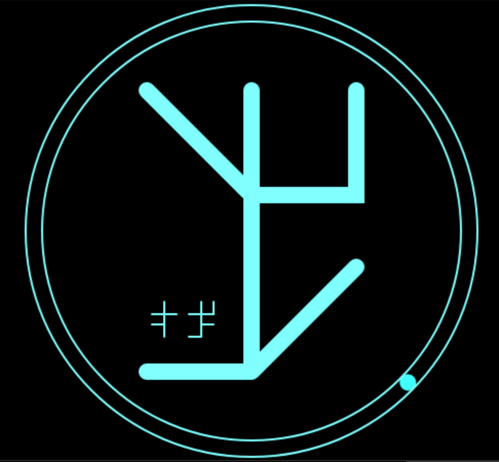

# Cistercian Clock
## Overview
It is a software clock that displays date and time in Cistercian numerals. They were invented by monks in 13th century and one can consider them as base 10,000 number system. A single character of the Cistercian numerals can represent a 4-digit base 10 number. To learn more about the numerals, see:
[https://en.wikipedia.org/wiki/Cistercian_numerals](https://en.wikipedia.org/wiki/Cistercian_numerals)
## Implementation 
The clock is implemented in Javascript with minimalistic design. At any given time the large character displays a 4-digit equivalent representing hours and minutes. The two smaller Cistercian characters in the lower left part of the clock display the current 4-digit year and a combination of month and day (2-digit each). Here is a screenshot of the clock displaying 13:48 on 2022/12/28:

## Install and Run
Just load the cclock.html into your web browser either as a file (some browsers have security settings preventing that) or by running a simple http server. One simple example would be:
> python -m SimpleHTTPServer
## License 
The code is released under the MIT License.